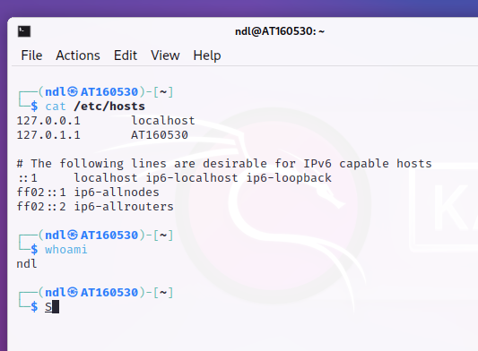

# BÀI TẬP LỚN KHAI THÁC LỖ HỔNG PHẦN MỀM

- Máy ảo:
Ở đây mình chọn `kali-purple-amd64` trên `https://www.kali.org/get-kali/#kali-installer-images` để làm hệ điều hành cho bài thực hành với hostname và username theo yêu cầu:



- pwntools:

Ở đây mình có sử dụng `script` khai thác viết bằng `python` có sử dụng `pwntools` nên mình sẽ cài đặt `pwntools`

```
$ sudo apt install python3-pip
$ pip install pwntools
```

`Pwntools` là một thư viện `Python` được sử dụng trong lĩnh vực phát triển exploit và thao tác với các file nhị phân (binary). Thư viện này cung cấp các công cụ và chức năng hỗ trợ cho việc thực hiện các tấn công bảo mật như buffer overflow, ROP (Return-Oriented Programming), format string exploits, và nhiều loại tấn công khác.

- GDB:

GDB (GNU Debugger) là một trình gỡ lỗi mạnh mẽ và phổ biến trong môi trường Linux, gdb dùng để theo dõi luồng thực thi của chương trình

- pwndbg:

`Pwndbg` là một plug-in cho GDB (GNU Debugger) được phát triển để hỗ trợ trong việc phân tích và thực thi các kỹ thuật tấn công và khai thác trong bảo mật phần mềm. Nó cung cấp các tính năng và giao diện tương tác cho GDB để giúp phân tích và gỡ lỗi các chương trình bị lỗi bảo mật như Buffer Overflow, ROP (Return-Oriented Programming), format string vulnerabilities, và nhiều kỹ thuật tấn công khác.

Một số tính năng chính của Pwndbg bao gồm:

1. Hiển thị địa chỉ ô nhớ, giá trị thanh ghi và thông tin khác một cách trực quan.

2. Hỗ trợ xem và sửa các cấu trúc dữ liệu như chuỗi, danh sách liên kết, heap và stack.

3. Tự động phát hiện các cấu trúc dữ liệu quan trọng như vùng nhớ heap, stack frame và global variable.

4. Hỗ trợ các công cụ phân tích như ROP gadget finder, cyclic pattern generation và shellcode assembler/disassembler.

5. Cung cấp các lệnh tùy chỉnh và chức năng mở rộng khác để giúp trong quá trình tìm lỗ hổng và khai thác.

Pwndbg là một công cụ phổ biến trong cộng đồng bảo mật và thường được sử dụng trong việc phân tích, tìm lỗi và khai thác ứng dụng. Nó cung cấp một giao diện dễ sử dụng và các tính năng tiện lợi để giúp phát hiện và tận dụng các lỗ hổng bảo mật trong chương trình.

Để cài đặt `pwndbg` ta mở terminal và sử dụng các câu lệnh sau:

```
git clone https://github.com/pwndbg/pwndbg
cd pwndbg
./setup.sh
```
- Hỗ trợ thực thi 32-bit:

Do chúng ta sử dụng hệ điều hành `kali-purple-amd64` 64 bit mà các challenges sử dụng cấu trúc x86-64 nên mình sẽ sử dụng câu lệnh:

```
sudo dpkg --add-architecture i386
sudo apt-get update
sudo apt-get install libc6:i386 libncurses5:i386 libstdc++6:i386
```
