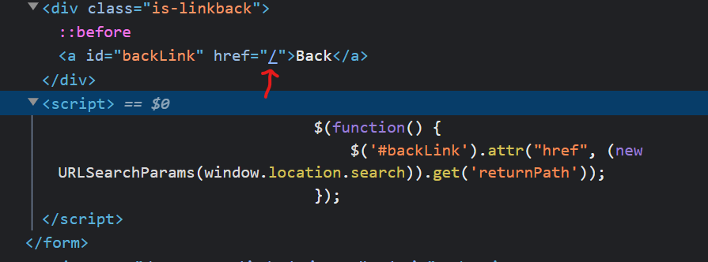

# DOM XSS in jQuery anchor href attribute sink using location.search source

# 1. Vulnerable

Ở lab này ta sẽ sử dụng `DOM-XSS` khiến khi người dùng nhấp vào chữ `back` có gán link bằng thẻ `<a> </a>` sẽ bị đưa đến nơi có mã độc


View-source:

```
<script>
    $(function() {
        $('#backLink').attr("href", (new URLSearchParams(window.location.search)).get('returnPath'));
    });
</script>
```


Đoạn code JS đã lấy giá trị cỉa `returnPath` trên `url` để gán cho `backLink`



# 2. Exploit

Theo như yêu cầu đề bài là phải gán link `alert()` để khi người dùng nhấp vào sẽ hiện ra thông báo

Do ở đây, đoạn mã 

```
<a id="backLink" href="some-url">Back</a>
```

Với thuộc tính `href` là địa chỉ khi mà người dùng nhấp vào thì sẽ được chuyển hướng đến đó.

Tuy nhiên, `href` lại có thể chứa link, đường dẫn tương đối của trang web hiện tại và cả code khi ta nhấp vào đó thì trang web sẽ thực thi

Vì vậy ta sẽ sửa nó thành 1 địa chỉ lệnh JS bằng payload: `javascript:alert(1)`


Như vậy, mỗi khi người dùng nhấp vào chữ `back` thì câu lệnh `javascript` trong đó sẽ được thực hiện